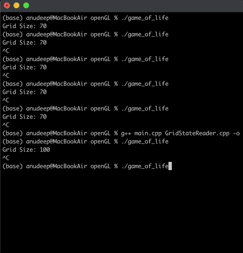
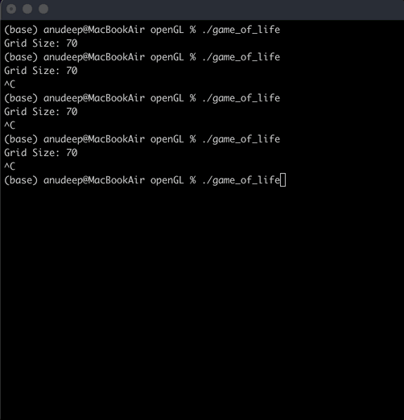
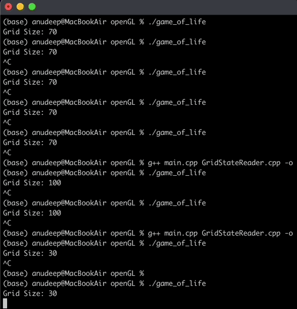
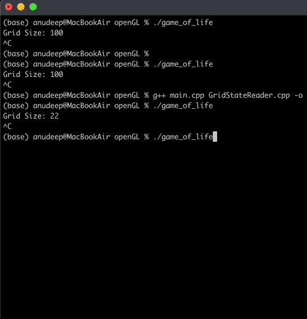
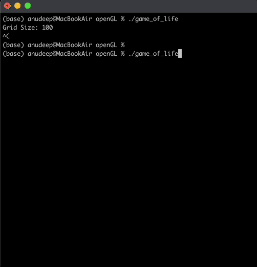

# Conways Game of life
The Conway's Game of Life or simply Life, is a cellular automaton devised by the British mathematician John Horton Conway.

## About the game:
* It is a zero player game
* It's evolution is determined by its initial state, requiring no further input
* The universe of the Game of Life is an infinite, two-dimensional orthogonal grid of square cells
* The cells can have 2 state, live or dead
* Every cell interacts with its eight neighbors
* Any live cell with fewer than two live neighbours dies
* Any live cell with two or three live neighbours lives on to the next generation
* Any live cell with more than three live neighbours dies
* Any dead cell with exactly three live neighbours becomes a live cell

## Implementation details:
* We have used MPI (Message Passing Interface) to implement Conway's Game of Life by distributing the grid among multiple processors for parallel computation
* Processes exchange boundary information to ensure correct neighbor updates across sub-grid boundaries using MPI communication primitives
* The input is a text file that contains the initial state of the game
* Addition the number of generations, grid size and output file name are passed as parameters
* For visualization we have used OpenGL 

## Patterns

## MPI Execution
* Clone the repo and move into the project directory
* To compile the code run the below command
  ```
    mkdir -p bin
    mpicc -o bin/conways_game src/*/*.c -lm
  ``` 
* To clean run the below command
  ```
    rm -rf bin
    rm -rf "conways_game.out"
  ``` 
* Once compilations is successful and without errors the job can be submitted to the HPC cluster using the below command:
  ```
    sbatch job.sl
  ```
* An output text file will be created
* For debugging errors and failures conways_game.out file can be used

## OpenGL Execution
This documentation includes videos illustrating a variety of patterns in Conway's Game of Life, all rendered with OpenGL to provide enhanced graphical clarity and fluidity. OpenGL, a powerful cross-platform graphics library, ensures high-quality visual representation of the evolving patterns, making it easier to observe intricate dynamics. The showcased patterns are demonstrated using predefined input files, carefully selected to highlight different behaviors and phenomena. These simulations are presented across grids of varying sizes, offering a comprehensive exploration of how the rules of Conway's Game of Life play out in diverse scenarios.


| Nova | Glider Gun | Pular Oscillator |
|:-----------:|:-----------:|:----------:|
|  |  |  |
| Infinite Oscillator | Unbounded Growth |
|:-----------:|:-----------:|
|  |  |

* To compile the code run the below command
```
g++ main.cpp StateReader.cpp -o gof -std=c++11 -I/opt/homebrew/include -L/opt/homebrew/lib -lGL -lglut -framework OpenGL
open -a XQuartz
export DISPLAY=:0

``` 

* To run the code run the below command
``` 
./gof
```
  
